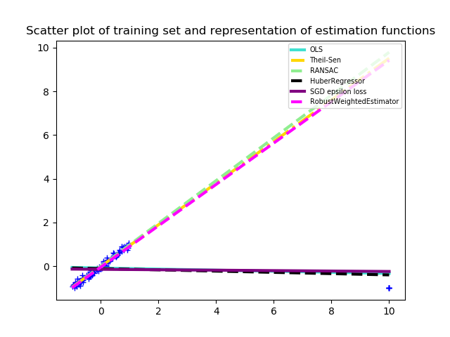

.. _robust:

===============================================================
Robust algorithms for Regression, Classification and Clustering
===============================================================

.. currentmodule:: sklearn_extra.robust

Robust statistics are mostly about how to deal with data corrupted with
outliers (i.e. abnormal data, unique data in some sense).
The aim is to modify classical  methods in order to deal with outliers while
loosing as little as possible in efficiency compared to classical (non-robust)
methods applied to non-corrupted datasets.
In particular, in machine learning, we want to bound the
influence that any minority of the dataset can have on the prediction, see
the figure for an example in regression.

.. centered:: |robust_regression|

What is an outlier ?
====================

The term "outlier" refers to a discordant minority of the dataset. It is
generally assumed to be a set of points situated outside the bulk of the data
but there exists more complex cases as illustrated in the figure below.

Formally, we define outliers for a given task by considering  points for
which the loss function takes unusually high values.
In the case of classification, one can consider that in the following scatter
plot the points in the up-right corner are outliers while the points in the
bottom-left corner are not.

.. centered:: |outlier|

Outliers can be caused by a lot of things, among them are human errors, captor
errors or inherent causes. These are often found for example in biology,
econometrics or datasets that describe some human relationships.

Here, we limit ourselves to linear estimators, but non-linear estimators are
also plagued with the same non-robustness properties. See scikit-learn RANSAC
documentation (`scikit-learn <https://scikit-learn.org/stable/modules/linear_model.html#ransac-random-sample-consensus>`__)
for an example of outliers for non-linear estimators.

Robust estimation with robust weighting
=======================================

A lot of learning algorithms are based on a paradigm known as empirical risk
minimization (ERM) which consists in finding the estimator :math:`\widehat{f}`
that minimizes an estimation of the risk.

.. math::

  \widehat{f} = \text{argmin}_{f\in F}\frac{1}{n}\sum_{i=1}^n\ell(f(X_i),y_i),

where the :math:`\ell` is a loss function (e.g. the squared distance in
regression problems). Said in another way, we are trying to minimize an
estimation of the expected risk and this estimation corresponds to an empirical
mean. However, it is well known that the empirical mean is not robust to
extreme data and these extreme values will have a big influence on the
estimation of :math:`\widehat{f}`. The principle behind the robust weighting
algorithm is to rely on a robust estimator (such as median-of-means (MOM) or
Huber estimator) in place of the empirical mean in the equation above [1]_.

In practice, one can define weights :math:`w_i` that depends on the
:math:`i^{th}` sample, with the weight :math:`w_i` being very small when
the :math:`i^{th}` data is an outlier and large otherwise.
This way, the problem is reduced to the following optimization :

.. math::

  \min_{f}\, \frac{1}{n} \sum_{i=1}^n w_i\ell(f(X_i),y_i)

Remark that the weights :math:`w_i` depends on :math:`\widehat{f}`, and the
resulting algorithm is then an alternate optimization scheme, iteratively
doing one step to optimize with respect to :math:`f` while the weights stay
fixed and then one step to estimate the weights while :math:`f` stays fixed.
These two steps are then repeated until convergence.

Robust estimation in practice
=============================

The algorithm
-------------

The approach is implemented as a meta algorithm that takes as input a base
estimator (e.g., SGDClassifier, SGDRegressor or MiniBatchKMeans).

At each step, the algorithm estimates sample weights that are meant to be small
for outliers and large for inliers and then we do one optimization step using
the base_estimator optimization algorithm.

There are two weighting scheme supported in this algorithm: Huber-like weights
and median-of-means weights. These two types of weights both come with a
parameter that will determine the robustness/efficiency trade-off of the
estimation.

* Huber weights : the parameter "c" is a positive real number. For small
  values of c the estimator is more robust but less efficient than it is
  for large values of c.
  A good heuristic consists in choosing c as an estimate of the standard
  deviation of the losses of the inliers. In practice, if c=None, it is
  estimated with the inter-quartile range.

* Median-of-means weights : the parameter "k" is a non-negative integer,
  when k=0 the estimator is exactly the same as base_estimator and when
  k=sample_size/2 the estimator is very robust but less efficient on inliers.
  A good heuristic consists in choosing k as an estimate of the number of
  outliers. In practice, if k=None, it is estimated using the number of
  points distant from the median of more than a 1.45 times the inter-quartile
  range.

  .. table:: Robustness/Efficiency tradeoff and choice of parameters
     :widths: auto
     :align: center

     +-----------+----------------------+-----------------+-------------------+
     | weighting | Robustness parameter | Small parameter | Large parameter   |
     +===========+======================+=================+===================+
     |    mom    |          k           |   Non robust    |      Robust       |
     +-----------+----------------------+-----------------+-------------------+
     |   huber   |          c           |   Robust        |      Non robust   |
     +-----------+----------------------+-----------------+-------------------+

The choice of the optimization parameters max_iter and eta_0 are also very
important for the efficiency of this estimator. It is recommended to use
`cross-validation <https://scikit-learn.org/stable/modules/cross_validation.html>`__
to fix these hyper-parameters. Choosing eta0 too large
can have the effect of making the estimator non-robust. One should also take
care that it can be important to rescale the data (the same way as it is
important to do it for SGD). In the context of a corrupted dataset, please use
`RobustScaler <https://scikit-learn.org/stable/modules/generated/sklearn.preprocessing.RobustScaler.html>`__.

This algorithm has been studied in the context of "mom" weights in the
article [1]_, the context of "huber" weights has been mentioned in [2]_.
Both weighting scheme can be seen as special cases of the algorithm in [3]_.

Comparison with other robust estimators
---------------------------------------

There are already some robust algorithms in scikit-learn but one major
difference is that robust algorithms in scikit-learn are primarily meant for
Regression, see `robustness in regression <https://scikit-learn.org/stable/modules/linear_model.html#robustness-regression-outliers-and-modeling-errors>`__.
Hence, we will not talk about classification algorithms in this comparison.

As such we only compare ourselves to TheilSenRegressor and RANSACRegressor as
they both deal with outliers in X and in Y and are closer to
RobustWeightedRegressor.

**Warning:** Huber weights used in our algorithm should not be confused with
HuberRegressor or other regression with “robust losses”. Those types of
regressions are robust only to outliers in the label Y but not in X.

Pro: RANSACRegressor and TheilSenRegressor both use a hard rejection of
outlier. This can be interpreted as though there was an outlier detection
step and then a regression step whereas RobustWeightedRegressor is directly
robust to outliers. This often increase the performance on moderatly corrupted
datasets.

Con: In general, this algorithm is slower than both  TheilSenRegressor and
RANSACRegressor.

Speed and limits of the algorithm
---------------------------------

Most of the time, it is interesting to do robust statistics only when there
are outliers and notice that a lot of dataset have previously been "cleaned"
of an outliers in which case this algorithm is not better than base_estimator.

In high dimension, the algorithm is expected to be as good
(or as bad) as base_estimator do in high dimension.

Complexity and limitation:

* weighting=”huber”: the complexity is larger than that of base_estimator but
  it is still of the same order of magnitude.
* weighting=”mom”: the larger k is the faster the algorithm will perform if
  sample_size is large. This weighting scheme is advised only with
  sufficiently large dataset (thumb rule sample_size > 500 the specifics
  depend on the dataset).

**Warning:** On a real dataset, one should be aware that there can be outliers
in the training set but also in the test set when the loss is not bounded. See
the example with California housing real dataset, for further discussion.

.. topic:: References:

    .. [1] Guillaume Lecué, Matthieu Lerasle and Timothée Mathieu.
           `"Robust classification via MOM minimization" <https://doi.org/10.1007/s10994-019-05863-6>`_, Machine Learning Journal (2020).

    .. [2] Christian Brownlees, Emilien Joly and Gábor Lugosi.
           `"Empirical risk minimization for heavy-tailed losses" <https://projecteuclid.org/euclid.aos/1444222083>`_, Ann. Statist.
           Volume 43, Number 6 (2015), 2507-2536.

    .. [3] Stanislav Minsker and Timothée Mathieu.
           `"Excess risk bounds in robust empirical risk minimization" <https://arxiv.org/abs/1910.07485>`_
           arXiv preprint (2019). arXiv:1910.07485.
